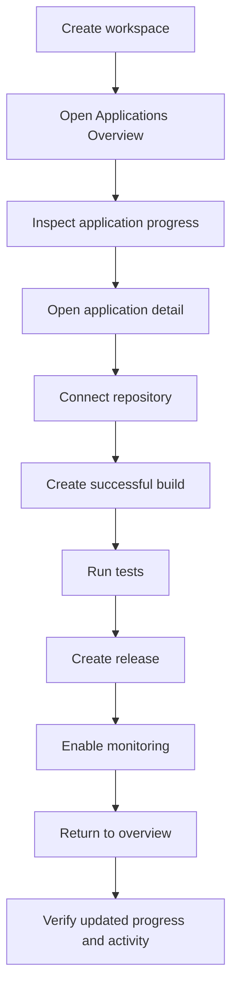

# Applications Control Center — Implementation and Testing Plan

The first requirement is a reliable progress model. Completion percentages must come from stored milestones and operational evidence, not arbitrary frontend calculations.

## Phase 1 — Progress contracts and rules

### Build

- Define `ApplicationProgressSummary`.
- Define a workspace-level aggregated summary.
- Define milestone statuses:

  - `NOT_STARTED`
  - `IN_PROGRESS`
  - `COMPLETED`
  - `BLOCKED`
  - `FAILED`

- Create progress rules for:

  - Application setup
  - Repository connection
  - Development activity
  - Builds
  - Tests
  - Security
  - Monitoring
  - Releases

- Define weighted completion calculation.
- Add current work, completed work, and remaining work fields.

### Tests

- Unit-test every milestone rule.
- Test zero-data applications.
- Test partial completion.
- Test failed builds and tests.
- Test completion never exceeds 100%.
- Test identical input produces identical progress.
- Test web, mobile, and desktop calculations separately.

## Phase 2 — Backend overview API

### Build

Create:

```http
GET /api/v1/workspaces/:workspaceId/applications/overview
```

Response:

```ts
interface WorkspaceApplicationsOverview {
  workspace: {
    id: string;
    name: string;
    completionPercent: number;
    health: 'HEALTHY' | 'WARNING' | 'CRITICAL' | 'UNKNOWN';
  };
  totals: {
    applications: number;
    repositories: number;
    openAlerts: number;
    passingBuilds: number;
    failingBuilds: number;
  };
  applications: ApplicationProgressSummary[];
  recentActivity: WorkspaceActivitySummary[];
  nextActions: WorkspaceNextAction[];
}
```

Aggregate information from:

- Applications
- Websites
- Mobile applications
- Desktop applications
- Repositories
- Builds
- Tests
- Releases
- Monitoring
- Alerts
- Security
- Activity

### Tests

#### Unit tests

- Correct aggregation by application type.
- Correct completion calculation.
- Correct health calculation.
- Correct latest build and release selection.
- Correct next-action ordering.
- No duplicate applications.
- Missing telemetry produces `UNKNOWN`, not `HEALTHY`.

#### API E2E tests

- Owner can access the overview.
- Workspace member can access based on role.
- Unauthorized user receives `401`.
- Non-member receives `404`.
- Cross-workspace data never appears.
- Empty workspace returns valid zero-state data.
- Mixed web/mobile/desktop workspace returns all applications.
- Deleted applications are excluded.
- Query count and response time remain bounded.

## Phase 3 — Applications Overview frontend

### Build

Route:

```text
/workspaces/:workspaceId/applications
```

Add:

- Workspace summary header
- Overall completion indicator
- Health indicator
- Application totals
- Repository count
- Open-alert count
- Latest activity
- Web, mobile, and desktop application cards
- Completed, in-progress, and remaining tasks
- Next-action buttons
- Loading, empty, error, and retry states
- Responsive mobile layout

### Component tests

- Renders workspace summary.
- Renders all application types.
- Displays correct progress percentages.
- Displays current and next work.
- Displays failed build state.
- Displays missing repository state.
- Displays unknown monitoring state.
- Handles an empty workspace.
- Handles API errors and retry.
- Application cards navigate to correct routes.
- Progress indicators include accessible labels.
- Mobile layout does not overflow.

## Phase 4 — Detailed application views

### Website view

Verify:

- Website summary
- Repository connection
- Tracking installation
- Events and analytics
- Processing and reports
- Monitoring
- Settings

### Mobile view

Verify:

- Platform information
- Repository and code
- Builds and artifacts
- Tests
- Performance
- Alerts
- Security
- Releases
- Settings

### Desktop view

Verify:

- Platform information
- Repository and code
- Builds
- Dependencies
- Tests
- Releases
- Crashes
- Performance
- Alerts
- Security
- Settings

### Tests

- Overview card opens the correct detail page.
- Back navigation returns to Applications Overview.
- Detail data matches the overview summary.
- New build updates overview status.
- Successful tests update completion.
- New release updates the latest-release field.
- Repository connection removes the repository blocker.
- Monitoring configuration updates health.

## Phase 5 — Activity and next actions

### Build

Create normalized workspace activity for:

- Repository connected or synchronized
- Build started, passed, or failed
- Test run completed
- Release created
- Alert triggered or resolved
- Security scan completed
- Monitoring configured
- Application settings changed

Generate actionable recommendations such as:

- Connect repository
- Run first build
- Fix failed tests
- Configure monitoring
- Resolve alert
- Create release

### Tests

- Activities appear in correct time order.
- Activities remain workspace-scoped.
- Duplicate events are deduplicated.
- Next actions reflect current application state.
- Completed actions disappear.
- Failed critical tasks receive higher priority.
- Links navigate to the correct application section.

## Phase 6 — Full browser workflow



### Playwright scenario 1 — Guided workspace

1. Sign in.
2. Create a workspace using Guided Builder.
3. Select web, mobile, and desktop.
4. Confirm the blueprint.
5. Verify redirect to Applications Overview.
6. Verify three application cards.
7. Verify initial progress and next actions.

### Playwright scenario 2 — Repository progress

1. Open an incomplete application.
2. Connect a verified repository.
3. Return to the overview.
4. Verify repository status is completed.
5. Verify completion percentage increased.

### Playwright scenario 3 — Build and testing progress

1. Create a build.
2. Mark it successful.
3. Record passing tests.
4. Return to the overview.
5. Verify build and test milestones are complete.

### Playwright scenario 4 — Failure handling

1. Create a failed build.
2. Trigger an alert.
3. Verify workspace health becomes warning or critical.
4. Verify corrective next actions appear.

### Playwright scenario 5 — Tenant isolation

1. Create two users and two workspaces.
2. Seed applications in both.
3. Verify each user sees only authorized workspace data.
4. Verify direct cross-workspace URLs return `404`.

### Playwright scenario 6 — Responsive UI

Test at:

- 375px mobile
- 768px tablet
- 1440px desktop

Verify cards, navigation, progress indicators, and action buttons remain usable.

## Phase 7 — Performance and accessibility

### Performance tests

- Overview API response remains under the agreed limit.
- No N+1 database queries.
- Paginate recent activity.
- Limit application and alert projections.
- Index workspace and application foreign keys.
- Load detail data only when a card is opened.
- Test workspaces containing many applications and activities.

### Accessibility tests

- Keyboard navigation works.
- Progress bars have accessible names and values.
- Health does not depend only on color.
- Cards use meaningful headings.
- Alerts use appropriate live regions.
- Focus moves correctly after navigation.
- Loading and error states are announced.

## Phase 8 — Final verification

Run:

1. Prisma validation and clean migration replay.
2. Shared-package builds.
3. Root typecheck.
4. Root lint.
5. Backend unit tests.
6. Applications Overview API E2E tests.
7. Web component tests.
8. Guided Builder regression tests.
9. Applications full-stack Playwright tests.
10. API and web production builds.
11. Git whitespace check.

## Completion criteria

The workflow is complete only when:

- All three creation methods reach Applications Overview.
- Web, mobile, and desktop cards display correct data.
- Progress derives from real backend evidence.
- Detail pages match overview data.
- Activity and next actions update after operations.
- Authorization and tenant isolation pass.
- Empty, loading, failure, and responsive states pass.
- Lint, typecheck, tests, migration replay, and production builds pass.
