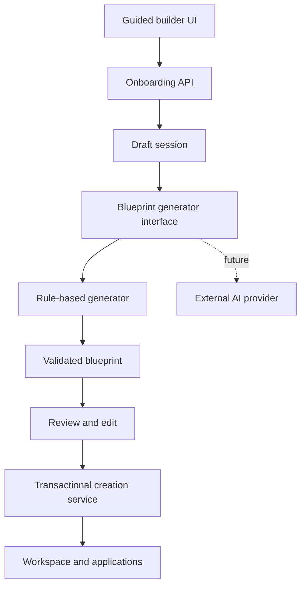

# Guided Workspace Builder — Detailed Implementation Plan

## 1. Feature Summary

The Guided Workspace Builder adds a third workspace-creation path to SaaS Command Center:

1. Manual workspace creation
2. GitHub-based workspace creation
3. Guided workspace creation

The new flow presents questions in a conversational interface, converts the answers into structured data, applies deterministic rules, generates a complete workspace blueprint, lets the user review and edit it, and then creates the workspace and its related application records in one controlled operation.

The first release must not depend on a paid AI API. It will use a versioned rule engine and product templates. The architecture will expose a generator interface so a real AI provider can be added later without replacing the frontend flow or workspace-creation pipeline.

## 2. Product Goals

- Reduce the effort required to configure a new workspace.
- Support web, mobile, and desktop application planning in one flow.
- Recommend practical technology stacks based on project requirements.
- Generate a reviewable blueprint before writing permanent workspace data.
- Preserve the existing manual and GitHub creation options.
- Work without paid external AI services.
- Allow future migration to OpenAI, Gemini, or another AI provider.
- Produce deterministic, testable results in the first release.

## 3. Non-Goals for the First Release

- Generating application source code.
- Creating or purchasing external cloud resources.
- Creating GitHub repositories without explicit user authorization.
- Automatically deploying applications.
- Pretending that rule-based output was produced by an AI model.
- Accepting unrestricted natural-language commands that directly modify the database.
- Supporting arbitrary technology combinations that are not represented in the platform catalog.

## 4. User Experience

### 4.1 Workspace creation choices

The workspace creation page will show three options:

| Option             | Purpose                                                  |
| ------------------ | -------------------------------------------------------- |
| Create manually    | Existing form for users who know the exact configuration |
| Import from GitHub | Existing repository-based creation flow                  |
| Use guided builder | Conversational questionnaire and generated blueprint     |

### 4.2 Guided builder flow

1. The user selects **Use guided builder**.
2. The system creates a draft onboarding session.
3. Questions appear one at a time in a chat-style interface.
4. The user can move backward and change previous answers.
5. Conditional questions appear only when relevant.
6. The rule engine generates a workspace blueprint.
7. The user reviews and edits the blueprint.
8. Validation errors are shown before creation.
9. The user confirms creation.
10. The backend creates all records transactionally.
11. The user is redirected to the completed workspace overview.

### 4.3 Initial questions

| Key                    | Question                                 | Answer type                       | Required    |
| ---------------------- | ---------------------------------------- | --------------------------------- | ----------- |
| `productIdea`          | What are you building?                   | Short text                        | Yes         |
| `workspaceName`        | What should the workspace be called?     | Short text                        | Yes         |
| `productType`          | What type of product is it?              | Single select                     | Yes         |
| `targetUsers`          | Who will use the product?                | Multi-select and optional text    | Yes         |
| `applicationTypes`     | Which applications do you need?          | Web/mobile/desktop multi-select   | Yes         |
| `coreFeatures`         | Which features are required?             | Multi-select and custom additions | Yes         |
| `authentication`       | Does the product require user accounts?  | Yes/no                            | Yes         |
| `collaboration`        | Does it require real-time collaboration? | Yes/no                            | Conditional |
| `notifications`        | Which notifications are required?        | Multi-select                      | Conditional |
| `technologyPreference` | Do you have preferred technologies?      | Structured optional selection     | No          |
| `repositories`         | Do repositories already exist?           | None/connect later/connect now    | Yes         |
| `environments`         | Which environments are required?         | Multi-select                      | Yes         |
| `qualityRequirements`  | Which engineering systems are required?  | Multi-select                      | Yes         |

### 4.4 Conditional question examples

- Ask Android/iOS framework preferences only when mobile is selected.
- Ask Windows/macOS/Linux targets only when desktop is selected.
- Ask browser and rendering preferences only when web is selected.
- Ask notification channels only when notifications are selected as a feature.
- Ask collaboration scale only when real-time collaboration is enabled.
- Ask for GitHub authorization only when the user selects **Connect now**.

## 5. Blueprint Output

The generated blueprint must contain:

- Workspace name, slug, description, and product type
- Target users and product goals
- Selected application types
- One proposed configuration per application
- Recommended frontend and backend technologies
- Database, cache, authentication, and real-time recommendations
- Core features and initial engineering tasks
- Development, staging, and production environments
- Repository placeholders or selected GitHub repositories
- Build, release, monitoring, analytics, performance, and security defaults
- Rule explanations for every generated recommendation
- Blueprint schema version and rule-set version

### 5.1 Example blueprint

```json
{
  "schemaVersion": 1,
  "generator": {
    "provider": "rules",
    "version": "1.0.0"
  },
  "workspace": {
    "name": "TodoFlow",
    "slug": "todoflow",
    "description": "A cross-platform task management product",
    "productType": "PRODUCTIVITY_SAAS"
  },
  "applications": [
    {
      "type": "WEB",
      "name": "TodoFlow Web",
      "platforms": ["WEB"],
      "stack": ["NEXT_JS", "TYPESCRIPT"]
    },
    {
      "type": "MOBILE",
      "name": "TodoFlow Mobile",
      "platforms": ["ANDROID", "IOS"],
      "stack": ["KOTLIN", "JETPACK_COMPOSE", "SWIFT", "SWIFTUI"]
    },
    {
      "type": "DESKTOP",
      "name": "TodoFlow Desktop",
      "platforms": ["WINDOWS"],
      "stack": ["TAURI", "TYPESCRIPT"]
    }
  ],
  "services": {
    "backend": ["NEST_JS"],
    "database": ["POSTGRESQL"],
    "cache": ["REDIS"],
    "authentication": ["EMAIL_PASSWORD", "GOOGLE_OAUTH"]
  },
  "features": ["TASKS", "PROJECTS", "REMINDERS", "SYNC"],
  "environments": ["DEVELOPMENT", "STAGING", "PRODUCTION"],
  "engineeringSystems": ["CI_CD", "MONITORING", "PERFORMANCE", "SECURITY"],
  "recommendations": []
}
```

## 6. Architecture



### 6.1 Provider interface

```ts
export interface WorkspaceBlueprintGenerator {
  generate(input: GenerateWorkspaceBlueprintInput): Promise<WorkspaceBlueprint>;
}
```

Initial provider:

```ts
export class RuleBasedWorkspaceBlueprintGenerator implements WorkspaceBlueprintGenerator {
  generate(input: GenerateWorkspaceBlueprintInput) {
    return this.ruleEngine.build(input);
  }
}
```

Future provider:

```ts
export class AiWorkspaceBlueprintGenerator implements WorkspaceBlueprintGenerator {
  // Calls a configured external model and validates its structured output.
}
```

Provider configuration:

```env
WORKSPACE_GENERATOR_PROVIDER=rules
WORKSPACE_GENERATOR_SCHEMA_VERSION=1
WORKSPACE_RULE_SET_VERSION=1.0.0
```

## 7. Data Model

Names should be adjusted to match existing Prisma conventions. Do not duplicate existing workspace, application, repository, environment, feature, or technology models.

### 7.1 Proposed onboarding session

```prisma
model WorkspaceOnboardingSession {
  id                 String   @id @default(cuid())
  userId             String
  status             WorkspaceOnboardingStatus @default(IN_PROGRESS)
  currentStep        String?
  answers            Json
  blueprint          Json?
  schemaVersion      Int      @default(1)
  ruleSetVersion     String?
  generatorProvider  String   @default("rules")
  workspaceId        String?  @unique
  idempotencyKey     String?  @unique
  expiresAt          DateTime
  completedAt        DateTime?
  createdAt          DateTime @default(now())
  updatedAt          DateTime @updatedAt

  user               User      @relation(fields: [userId], references: [id], onDelete: Cascade)
  workspace          Workspace? @relation(fields: [workspaceId], references: [id])

  @@index([userId, status])
  @@index([expiresAt])
}

enum WorkspaceOnboardingStatus {
  IN_PROGRESS
  BLUEPRINT_READY
  CREATING
  COMPLETED
  FAILED
  EXPIRED
}
```

### 7.2 Storage decisions

- Store answers and generated blueprints as JSON during the draft stage.
- Validate JSON against shared schemas on every write.
- Create normalized workspace and application records only after confirmation.
- Keep the final blueprint snapshot for auditability and troubleshooting.
- Do not make the draft session the permanent source of truth after creation.
- Remove or anonymize expired drafts according to the retention policy.

## 8. Shared Contracts and Validation

Add shared contracts to the existing shared-types and validation packages.

Required contracts:

- `WorkspaceOnboardingAnswers`
- `WorkspaceOnboardingSessionResponse`
- `WorkspaceQuestionDefinition`
- `GenerateWorkspaceBlueprintInput`
- `WorkspaceBlueprint`
- `WorkspaceBlueprintApplication`
- `WorkspaceBlueprintServiceConfiguration`
- `WorkspaceBlueprintRecommendation`
- `UpdateWorkspaceBlueprintInput`
- `ConfirmWorkspaceBlueprintInput`
- `WorkspaceCreationResult`

Validation requirements:

- Workspace name length and allowed characters
- Unique or safely generated workspace slug
- At least one application type
- Platform compatibility with application type
- Technology compatibility with platform
- Supported enum values only
- No duplicate platforms, technologies, features, or environments
- Repository ownership and workspace-access validation
- Maximum text lengths and collection sizes
- Blueprint schema-version validation
- Cross-field validation for conditional answers

## 9. Rule Engine Design

### 9.1 Rule structure

Rules should be data-driven and versioned instead of being scattered through controllers.

```ts
type WorkspaceRule = {
  id: string;
  version: string;
  priority: number;
  when: (context: RuleContext) => boolean;
  apply: (draft: WorkspaceBlueprintDraft, context: RuleContext) => void;
  explanation: string;
};
```

### 9.2 Rule categories

- Product classification rules
- Application and platform rules
- Technology-stack recommendation rules
- Backend and persistence rules
- Authentication rules
- Real-time communication rules
- Notification rules
- Environment rules
- Build and release rules
- Monitoring and performance rules
- Security baseline rules
- Repository mapping rules

### 9.3 Example mappings

| Condition                        | Generated recommendation                           |
| -------------------------------- | -------------------------------------------------- |
| Web selected                     | Next.js and TypeScript defaults                    |
| Android selected                 | Kotlin and Jetpack Compose defaults                |
| iOS selected                     | Swift and SwiftUI defaults                         |
| Cross-platform mobile preference | React Native or Flutter from supported catalog     |
| Windows/macOS desktop selected   | Tauri or Electron from supported catalog           |
| Authentication enabled           | Email/password plus optional OAuth                 |
| Real-time collaboration enabled  | WebSocket transport and Redis coordination         |
| Relational business data         | PostgreSQL                                         |
| Scheduled reminders              | Background job system and notification service     |
| Production selected              | CI/CD, monitoring, alerting, security, and backups |

### 9.4 Conflict resolution

- Explicit user selections override defaults when supported.
- Invalid combinations must be rejected, not silently corrected.
- Higher-priority rules override lower-priority defaults.
- Every override must be deterministic.
- Every generated recommendation must include a reason and source rule ID.
- The final blueprint must pass schema and compatibility validation.

## 10. API Design

All endpoints require authentication. Session ownership must be checked on every request.

| Method   | Endpoint                                       | Purpose                               |
| -------- | ---------------------------------------------- | ------------------------------------- |
| `POST`   | `/workspace-onboarding/sessions`               | Start a draft session                 |
| `GET`    | `/workspace-onboarding/sessions/:id`           | Resume a session                      |
| `PATCH`  | `/workspace-onboarding/sessions/:id/answers`   | Save one or more answers              |
| `GET`    | `/workspace-onboarding/sessions/:id/questions` | Get applicable questions and progress |
| `POST`   | `/workspace-onboarding/sessions/:id/blueprint` | Generate or regenerate blueprint      |
| `PATCH`  | `/workspace-onboarding/sessions/:id/blueprint` | Save allowed user edits               |
| `POST`   | `/workspace-onboarding/sessions/:id/validate`  | Validate the current blueprint        |
| `POST`   | `/workspace-onboarding/sessions/:id/confirm`   | Create workspace transactionally      |
| `DELETE` | `/workspace-onboarding/sessions/:id`           | Discard a draft session               |

### 10.1 API behavior requirements

- Return field-level validation errors.
- Support session resume after page refresh.
- Require an idempotency key for confirmation.
- Reject confirmation if the blueprint is stale or invalid.
- Return the existing result when a successful confirmation is retried.
- Never accept client-provided ownership, role, billing, or authorization values.
- Use the authenticated user as the source for ownership decisions.

## 11. Transactional Creation Service

The confirmation endpoint must call a dedicated orchestration service. Controllers must not create related records individually.

Recommended creation order:

1. Lock and verify the onboarding session.
2. Verify `BLUEPRINT_READY` status.
3. Validate the blueprint again on the server.
4. Mark the session as `CREATING`.
5. Create the workspace.
6. Create the owner membership.
7. Create web, mobile, and desktop application records.
8. Create or associate technology selections.
9. Create features, environments, and engineering-system settings.
10. Create repository placeholders or verified repository links.
11. Create initial tasks or recommendations if supported by the current domain model.
12. Link the onboarding session to the workspace.
13. Mark the session as `COMPLETED`.
14. Commit the transaction.

If a required database write fails, the transaction must roll back. External GitHub operations cannot participate in the database transaction; they should use a separate explicit step with retryable status records.

## 12. Frontend Design

### 12.1 Routes

Suggested routes:

```text
/workspaces/new
/workspaces/new/guided
/workspaces/new/guided/:sessionId
/workspaces/new/guided/:sessionId/review
/workspaces/new/guided/:sessionId/creating
```

### 12.2 Main components

- `WorkspaceCreationMethodCards`
- `GuidedWorkspaceBuilderShell`
- `OnboardingConversation`
- `OnboardingQuestionCard`
- `SingleChoiceAnswer`
- `MultiChoiceAnswer`
- `TextAnswer`
- `TechnologyPreferenceEditor`
- `OnboardingProgress`
- `BlueprintSummary`
- `BlueprintApplicationCard`
- `BlueprintStackEditor`
- `BlueprintFeatureEditor`
- `BlueprintValidationSummary`
- `WorkspaceCreationProgress`
- `ResumeDraftBanner`

### 12.3 Required UI states

- Loading session
- New session
- Saving answer
- Answer saved
- Save failure with retry
- Generating blueprint
- Blueprint ready
- Blueprint validation failure
- Creating workspace
- Creation succeeded
- Creation failed safely
- Session expired
- Unauthorized session access
- Responsive mobile navigation
- Keyboard and screen-reader interaction

### 12.4 Review screen

The review screen must show editable sections for:

- Workspace identity
- Applications and target platforms
- Technology stacks
- Features
- Environments
- Repository configuration
- Engineering systems
- Generated recommendations and explanations

Unsupported combinations must be prevented in the editor, not discovered only after submission.

## 13. Security and Privacy

- Require authentication for every onboarding operation.
- Enforce session ownership server-side.
- Apply rate limits to session creation, blueprint generation, and confirmation.
- Sanitize text rendered in the UI.
- Validate all JSON payloads with strict schemas.
- Limit answer and blueprint sizes to prevent storage abuse.
- Do not store GitHub access tokens inside onboarding JSON.
- Reuse the existing encrypted integration-token storage.
- Validate repository access immediately before linking.
- Record security-relevant confirmation failures.
- Do not allow prompt text or custom labels to become executable configuration.
- Avoid logging full product descriptions when logs are exported externally.

## 14. Observability and Analytics

Track events without storing sensitive answer content:

- `guided_builder_started`
- `guided_builder_question_answered`
- `guided_builder_step_back`
- `guided_builder_abandoned`
- `guided_builder_resumed`
- `guided_builder_blueprint_generated`
- `guided_builder_blueprint_edited`
- `guided_builder_validation_failed`
- `guided_builder_creation_started`
- `guided_builder_creation_succeeded`
- `guided_builder_creation_failed`

Operational metrics:

- Session completion rate
- Median time to blueprint
- Median time to workspace creation
- Validation failures grouped by field
- Rule-engine execution duration
- Transaction failure rate
- Idempotent retry count
- Draft abandonment rate

## 15. Detailed Delivery Phases

### Phase 1 — Requirements and Existing-Domain Audit

#### Backend

- Map current workspace, membership, repository, web, mobile, desktop, environment, build, release, monitoring, performance, alert, security, and AI-analysis models.
- Identify existing creation services that can be reused.
- Document required versus optional fields for every target model.
- Identify unique constraints and transaction boundaries.

#### Frontend

- Map the existing workspace-creation page and navigation.
- Identify reusable form controls, application cards, technology selectors, and error components.
- Define desktop and mobile layouts for the guided flow.

#### Tests

- Add characterization tests for current manual and GitHub creation flows.
- Confirm the new feature does not change existing API behavior.

#### Exit criteria

- A field-level mapping exists from blueprint fields to current database models.
- Existing creation flows pass unchanged.

### Phase 2 — Shared Contracts and Blueprint Schema

#### Backend/shared packages

- Create versioned answer and blueprint schemas.
- Add enums for supported question types and generator providers.
- Implement cross-field compatibility validation.
- Export contracts from shared packages.

#### Frontend

- Consume shared contracts without duplicating enums.
- Add client-safe parsing for API responses.

#### Tests

- Unit-test valid and invalid schemas.
- Test every application/platform compatibility rule.
- Test maximum lengths, empty selections, duplicates, and unsupported enum values.

#### Exit criteria

- Invalid blueprints cannot cross the API boundary.
- Shared packages typecheck and build successfully.

### Phase 3 — Onboarding Session Persistence

#### Backend

- Add the onboarding-session Prisma model and migration.
- Add repository and service layers.
- Implement session creation, retrieval, answer updates, expiration, and deletion.
- Add ownership guards.

#### Frontend

- Add API client methods for session lifecycle operations.
- Store the session ID in the route rather than only in browser memory.

#### Tests

- Unit-test status transitions and expiration.
- E2E-test creation, resume, update, delete, unauthorized access, and expired sessions.

#### Exit criteria

- A user can safely start and resume a draft after refresh.
- Another user cannot read or modify the session.

### Phase 4 — Question Catalog and Conditional Flow

#### Backend

- Create a versioned question catalog.
- Implement conditional-question selection.
- Return progress and the next applicable question.
- Re-evaluate dependent answers when an earlier answer changes.

#### Frontend

- Build chat-style question rendering.
- Add text, single-select, multi-select, yes/no, platform, and technology inputs.
- Add back, continue, skip-optional, and save-retry behavior.

#### Tests

- Unit-test every branching path.
- Component-test all answer controls.
- E2E-test web-only, mobile-only, desktop-only, and multi-application flows.

#### Exit criteria

- Questions are deterministic and resumable.
- Irrelevant conditional questions never appear.

### Phase 5 — Rule Engine Foundation

#### Backend

- Implement the generator interface.
- Implement the rule-based provider.
- Add rule priority, conflict detection, explanations, and versioning.
- Ensure the same input and rule-set version always produce the same result.

#### Frontend

- Add blueprint-generation loading and failure states.
- Show generator type as **Guided recommendations** rather than claiming external AI.

#### Tests

- Snapshot representative generated blueprints.
- Unit-test rule order, explicit overrides, conflicts, and deterministic output.
- Test that invalid rule output is rejected by the blueprint schema.

#### Exit criteria

- Blueprint generation works without network access or paid services.
- Every recommendation contains an explanation.

### Phase 6 — Application and Technology Rules

#### Backend

- Add web platform and stack rules.
- Add Android and iOS rules.
- Add desktop platform and stack rules.
- Add backend, database, cache, authentication, notifications, and real-time rules.
- Reuse the current supported technology catalog.

#### Frontend

- Display generated application cards and technology groups.
- Mark user-selected values separately from generated defaults.

#### Tests

- Cover every supported application type and platform.
- Cover multi-platform combinations.
- Reject incompatible stacks and missing required technologies.

#### Exit criteria

- Generated applications map cleanly to existing web, mobile, and desktop models.

### Phase 7 — Blueprint Review and Editing

#### Backend

- Add blueprint retrieval, update, and validation endpoints.
- Whitelist fields users may edit.
- Recompute dependent recommendations when necessary.
- Track blueprint revision or hash to detect stale confirmation requests.

#### Frontend

- Build the complete review screen.
- Add application, platform, stack, feature, environment, and repository editors.
- Show field-level and section-level validation errors.
- Add regenerate and reset-to-recommendation controls.

#### Tests

- Component-test editors and error states.
- E2E-test editing generated values and rejecting incompatible changes.
- Test stale revision handling.

#### Exit criteria

- The user can understand and correct the blueprint before creation.
- Only a valid blueprint can proceed to confirmation.

### Phase 8 — Transactional Workspace Creation

#### Backend

- Implement the orchestration service.
- Reuse existing domain services where transaction participation is safe.
- Add idempotency and session locking.
- Create workspace, membership, applications, technologies, features, and environments.
- Persist the final blueprint snapshot.

#### Frontend

- Add confirmation dialog and creation-progress screen.
- Redirect to the new workspace only after success.
- Provide safe retry behavior after a recoverable failure.

#### Tests

- Integration-test successful full creation.
- Inject failures at different creation steps and verify rollback.
- Test repeated confirmation with the same idempotency key.
- Test concurrent confirmation requests.

#### Exit criteria

- No partial workspace remains after a failed database transaction.
- Retried requests cannot create duplicate workspaces.

### Phase 9 — GitHub Connection Integration

#### Backend

- Support `NONE`, `CONNECT_LATER`, and `CONNECT_NOW` repository strategies.
- Verify GitHub installation and repository access.
- Map selected repositories to generated applications.
- Separate external GitHub failures from the core database transaction.

#### Frontend

- Reuse the existing GitHub connection UI.
- Show repository selection only when requested.
- Allow workspace creation with clearly marked repository placeholders.

#### Tests

- Test connected, disconnected, expired authorization, inaccessible repository, and retry flows.
- Verify cross-workspace repository protections.

#### Exit criteria

- GitHub is optional and cannot block users who choose to connect later.

### Phase 10 — Engineering-System Defaults

#### Backend

- Generate compatible defaults for builds, releases, monitoring, analytics, performance, alerts, and security.
- Create configuration records only where existing models support safe defaults.
- Store unsupported recommendations as non-active recommendations rather than fake active integrations.

#### Frontend

- Add an engineering-systems review section.
- Distinguish active configuration, proposed configuration, and unavailable integration.

#### Tests

- Test defaults per application type and production environment.
- Verify no external integration is marked active without credentials and verification.

#### Exit criteria

- The generated workspace contains accurate states and no fictional integrations.

### Phase 11 — Security, Limits, and Retention

#### Backend

- Add endpoint-specific rate limits.
- Add payload-size and collection-size limits.
- Add session retention and expiration cleanup.
- Add audit events for confirmation and authorization failures.
- Review logs for accidental answer or token exposure.

#### Frontend

- Handle rate limits, expiration, permission errors, and session recovery.
- Ensure accessible labels and keyboard navigation.

#### Tests

- Test oversized input, malformed JSON, XSS payloads, unauthorized access, expired sessions, and rate limits.
- Run authorization tests for owner, admin, member, viewer, and non-member roles where applicable.

#### Exit criteria

- Security tests pass and draft retention is enforceable.

### Phase 12 — Full Frontend and E2E Coverage

#### Full-stack scenarios

1. Create a web-only workspace.
2. Create an Android and iOS mobile workspace.
3. Create a Windows/macOS desktop workspace.
4. Create web, mobile, and desktop applications together.
5. Edit a generated stack before confirmation.
6. Resume an interrupted session.
7. Change an early answer and verify dependent answers are removed or revalidated.
8. Create with GitHub repositories.
9. Create with repository placeholders.
10. Recover from a transient confirmation failure.
11. Prevent duplicate creation after repeated submission.
12. Reject cross-user session access.
13. Render API-error and empty states.
14. Complete the flow on a mobile viewport.
15. Verify existing manual and GitHub flows remain operational.

#### Exit criteria

- Unit, integration, frontend component, and full-stack E2E suites pass.
- The mobile viewport remains fully usable.

### Phase 13 — Observability and Controlled Rollout

#### Backend

- Add metrics and structured events.
- Add a feature flag for the guided builder entry point.
- Add rule-set version to logs and blueprint snapshots.

#### Frontend

- Hide the entry point when the flag is disabled.
- Add non-sensitive analytics events.

#### Tests

- Verify feature-flag behavior.
- Verify analytics exclude answer text and secrets.
- Run production-build and migration checks.

#### Exit criteria

- The feature can be enabled or disabled without deployment rollback.
- Operational failures can be traced to a session and rule-set version.

### Phase 14 — Future Real-AI Migration

This phase is not required for the no-cost first release.

#### Backend

- Add an AI provider adapter behind `WorkspaceBlueprintGenerator`.
- Require structured JSON output matching the existing blueprint schema.
- Add timeouts, retries, cost limits, model allowlists, and circuit breakers.
- Validate AI output with the same deterministic validators.
- Fall back to the rule-based generator when the provider is unavailable.
- Record provider and model metadata without storing hidden reasoning.

#### Frontend

- Keep the existing question and review experience.
- Show when a blueprint used AI-assisted generation.
- Preserve user review and confirmation requirements.

#### Tests

- Use a local deterministic fake provider in CI.
- Test malformed output, timeouts, provider failure, fallback, and schema rejection.
- Never call a paid provider from automated tests.

#### Exit criteria

- Changing providers requires configuration and an adapter, not a frontend rewrite.

## 16. Testing Matrix

| Layer                | Required coverage                                                          |
| -------------------- | -------------------------------------------------------------------------- |
| Unit                 | Schemas, question branching, rules, conflicts, mappings, state transitions |
| API integration      | Authentication, ownership, persistence, validation, idempotency            |
| Database integration | Migration, transaction rollback, uniqueness, concurrency                   |
| Frontend component   | Question inputs, progress, blueprint editors, error states                 |
| Full-stack E2E       | Complete web/mobile/desktop creation and failure recovery                  |
| Regression           | Existing manual and GitHub workspace creation                              |
| Security             | Authorization, rate limiting, payload limits, XSS, token handling          |
| Accessibility        | Keyboard navigation, labels, focus management, error announcements         |
| Responsive           | Desktop, tablet, and mobile viewport behavior                              |

## 17. Suggested Code Organization

```text
apps/api/src/workspace-onboarding/
  workspace-onboarding.module.ts
  workspace-onboarding.controller.ts
  workspace-onboarding.service.ts
  workspace-onboarding.repository.ts
  workspace-onboarding-creation.service.ts
  generators/
    workspace-blueprint-generator.interface.ts
    rule-based-workspace-blueprint.generator.ts
  questions/
    question-catalog.ts
    question-flow.service.ts
  rules/
    rule-engine.ts
    application.rules.ts
    technology.rules.ts
    infrastructure.rules.ts
    engineering-system.rules.ts

apps/web/src/features/workspace-onboarding/
  api/
  components/
  hooks/
  schemas/
  state/
  utils/

packages/shared-types/src/workspace-onboarding/
packages/validation/src/workspace-onboarding/
packages/test-code/api/e2e/workspace-onboarding/
packages/test-code/web/e2e/full-stack/workspace-onboarding/
```

The exact paths must follow the repository's established conventions after the Phase 1 audit.

## 18. Feature Flags and Configuration

```env
GUIDED_WORKSPACE_BUILDER_ENABLED=false
WORKSPACE_GENERATOR_PROVIDER=rules
WORKSPACE_GENERATOR_SCHEMA_VERSION=1
WORKSPACE_RULE_SET_VERSION=1.0.0
WORKSPACE_ONBOARDING_SESSION_TTL_HOURS=168
WORKSPACE_ONBOARDING_MAX_ANSWER_BYTES=32768
```

Production should initially enable the feature only for internal or selected users before general release.

## 19. Definition of Done

The feature is complete only when:

- Manual and GitHub workspace creation still work.
- A user can start, leave, and resume the guided flow.
- Conditional questions behave correctly.
- The rule engine generates deterministic, schema-valid blueprints.
- Web, mobile, and desktop configurations are supported.
- The user can review and edit the generated blueprint.
- Unsupported technology combinations are rejected.
- Confirmation creates all required records transactionally.
- Duplicate submissions do not create duplicate workspaces.
- GitHub connection remains optional.
- No integration is shown as active without verified credentials.
- Authorization, rate-limit, security, accessibility, and responsive tests pass.
- Unit, integration, full-stack E2E, lint, typecheck, and production build pass.
- The feature can be disabled with a feature flag.
- No paid AI API is required.

## 20. Recommended Delivery Order

Implement Phases 1–8 as the minimum complete product. Phases 9–13 harden and integrate it for production. Phase 14 should begin only when an external AI provider, budget, privacy policy, and operational limits are approved.
