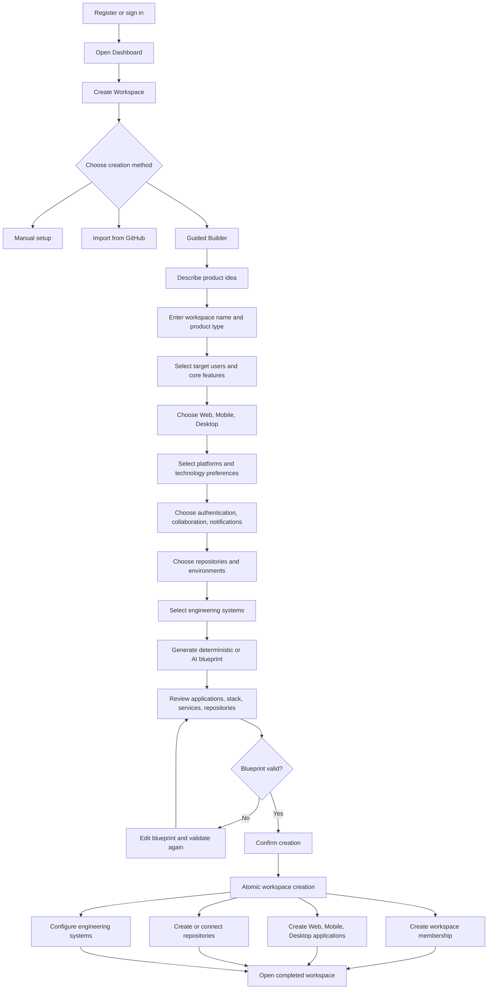
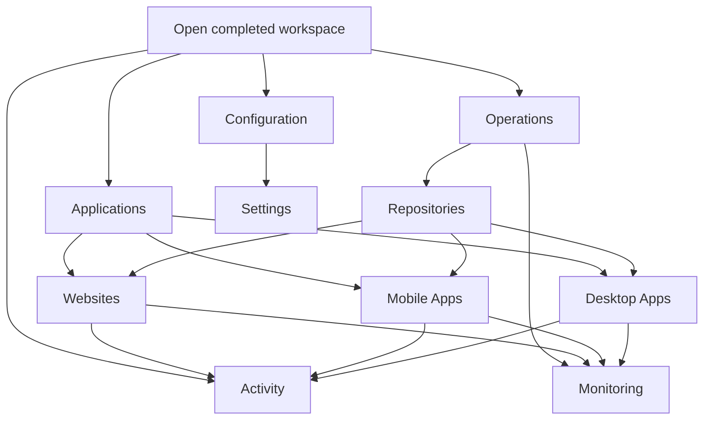
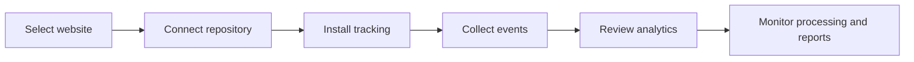
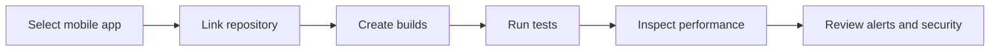
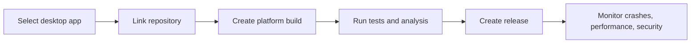
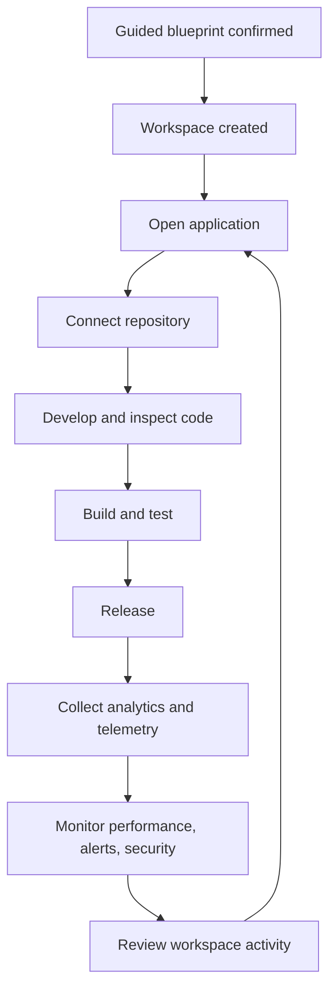

# Guided Workspace Builder — User Workflow

## Visual workflow

## Start-to-end user journey

1. The user registers or signs in.
2. The user opens **Dashboard → Create Workspace**.
3. The user chooses one of three creation methods:

   - **Manual setup:** Configure the workspace directly.
   - **GitHub import:** Analyze and import an existing repository.
   - **Guided Builder:** Answer questions and receive a complete recommended workspace blueprint.

4. Guided Builder creates a secure, resumable onboarding session.
5. The user answers questions covering:

   - Product idea, workspace name, product type, and target users
   - Required features
   - Web, mobile, and desktop applications
   - Mobile and desktop platforms
   - Technology preferences
   - Authentication, collaboration, and notifications
   - Repository strategy
   - Development, staging, and production environments
   - CI/CD, monitoring, analytics, performance, alerts, security, and backups

6. Every answer is validated and saved so the session can be resumed later.
7. The rules engine or configured AI provider generates a workspace blueprint.
8. The user reviews and can edit:

   - Workspace name, slug, description, and product type
   - Applications, platforms, and technology stacks
   - Backend, database, cache, and authentication services
   - Features and environments
   - Repository connections or placeholders
   - Engineering system configurations

9. The backend validates the complete blueprint and creates a revision number and hash.
10. The user confirms the exact validated blueprint revision.
11. In one database transaction, the backend creates:

    - The workspace
    - The owner's workspace membership
    - Selected web, mobile, and desktop applications
    - Repository placeholders or verified repository connections
    - Engineering system configurations
    - The completed onboarding-session record

12. Idempotency protection ensures repeated confirmation requests return the same result instead of creating duplicate workspaces.
13. The user is redirected to the completed workspace.
14. Inside the workspace, the user can manage:

    - Applications
    - Repositories and code
    - Builds and releases
    - Analytics
    - Monitoring and alerts
    - Performance
    - Security
    - Members and settings

## Inside the completed workspace

After atomic creation finishes, the user enters the operational workspace. The sidebar becomes the main navigation for managing everything created by the blueprint.

### 1. Applications

**Applications** is the combined application inventory for the workspace. It shows the web, mobile, and desktop products created by the Guided Builder and provides access to their individual workflows.

### 2. Websites

The user opens **Websites** to manage web products. The typical website workflow is:

The user can manage website details, installation, events, analytics, processing, reports, and settings.

### 3. Mobile Apps

The user opens **Mobile Apps** for Android, iOS, React Native, or Flutter application work:

The mobile area covers application configuration, source code, builds, tests, performance telemetry, alerts, and security information.

### 4. Desktop Apps

The user opens **Desktop Apps** for Windows, macOS, Linux, Electron, or Tauri application work:

The desktop area manages code, builds, build artifacts, releases, dependencies, tests, crashes, performance, alerts, security, and application settings.

### 5. Activity

**Activity** provides the workspace timeline. It records important actions from applications, repositories, builds, releases, members, and configuration changes so the user can understand what changed and when.

### 6. Monitoring

**Monitoring** combines operational health information from the workspace applications. The user can inspect telemetry, failures, performance changes, alerts, and service health without opening every application separately.

### 7. Repositories

**Repositories** manages GitHub connections shared across the workspace:

1. Connect or verify a GitHub repository.
2. Link it to a website, mobile app, or desktop app.
3. Synchronize repository metadata and code information.
4. Open the code explorer.
5. Use repository data in builds, analysis, security, and release workflows.

### 8. Settings

**Settings** controls workspace-level configuration, including workspace information, members and roles, integrations, feature configuration, and other administrative options.

## Complete operational lifecycle

## Current verification status

The core Guided Workspace Builder workflow is implemented. Final live-browser verification remains pending while the current onboarding validation and test-runner defects are repaired.
